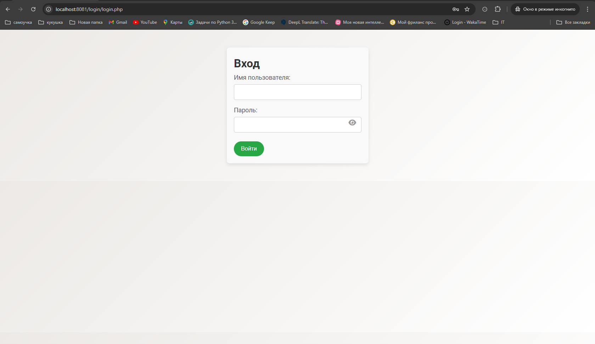

# FeBrein Time Tracker 2.2


## Описание

FeBrein Time Tracker — это веб-приложение для отслеживания рабочего времени и времени обеда. Оно позволяет пользователям начинать и останавливать рабочие и обеденные таймеры, а также сохранять сессии в базе данных. Приложение поддерживает роли пользователей, такие как обычный пользователь и администратор.

## Основные Функции

- **Начало работы:** Запуск таймера рабочего времени.
- **Начало обеда:** Переход в режим обеда с соответствующим таймером.
- **Продолжение работы:** Возвращение к рабочему режиму.
- **Окончание работы:** Завершение рабочей сессии с подтверждением.
- **Автообновление данных:** Обновление таблицы сессий каждую минуту.
- **Восстановление сессий:** Сохранение и восстановление состояния таймеров после перезагрузки страницы.
- **Подтверждение при закрытии страницы:** Запрос подтверждения при попытке закрыть страницу или браузер, если пользователь активно работает или находится на обеде.

## Скриншоты

### **Главный Экран**


### **Панель управления**


### **Экран Входа**



### **Экран Юзера**


## Установка

### **Требования**

- **PHP** версии 7.4 или выше.
- **MySQL** или другая совместимая база данных.
- **Веб-сервер** (например, Apache или Nginx).
- **XAMPP:** Пакет, включающий Apache, MySQL, PHP и другие инструменты.

### **Шаги по Установке**

1. **Установка XAMPP:**


   - Скачайте и установите [XAMPP](https://www.apachefriends.org/index.html) для вашей операционной системы.
   - Запустите XAMPP Control Panel и запустите модули **Apache** и **MySQL**.

2. **Клонирование Репозитория:**

   Откройте терминал или командную строку и выполните следующие команды:

   ```bash
   git clone https://github.com/ваше_имя_пользователя/febrein-time-tracker.git
   cd febrein-time-tracker

## Инструкция по импорту файла `febtime.sql` в phpMyAdmin

### Шаг 1: Подготовка

Убедитесь, что XAMPP установлен и запущен:

1. Откройте XAMPP Control Panel.
2. Запустите модули **Apache** и **MySQL**.
3. Проверьте доступность phpMyAdmin:
   - Откройте браузер и перейдите по адресу: [http://localhost:8081/phpmyadmin/index.php](http://localhost:8081/phpmyadmin/index.php).
   - Введите ваши учетные данные MySQL (по умолчанию в XAMPP — пользователь `root` без пароля).

### Шаг 2: Создание базы данных (если еще не создана)

1. В phpMyAdmin перейдите на вкладку **Databases** (Базы данных).
2. В поле **Create database** (Создать базу данных) введите название базы данных, например, `febtime`.
3. Выберите **Collation** (Сопоставление) — рекомендуется `utf8mb4_general_ci` для поддержки русского языка.
4. Нажмите **Create** (Создать).

### Шаг 3: Импорт файла `febtime.sql`

1. Перейдите на страницу импорта:
   - Если вы уже находитесь на странице импорта (URL: `http://localhost:8081/phpmyadmin/index.php?route=/database/import&db=febtime`), переходите к следующему шагу.
   - Иначе выберите базу данных `febtime` в левой колонке, затем перейдите на вкладку **Import** (Импорт).

2. В разделе **File to import** (Файл для импорта) нажмите кнопку **Choose File** (Выбрать файл) и выберите файл `febtime.sql` на вашем компьютере.

3. Убедитесь, что в поле **Format** (Формат) выбран **SQL**. Остальные параметры можно оставить по умолчанию.

4. Нажмите кнопку **Go** (Выполнить) внизу страницы и дождитесь завершения процесса импорта. После успешного импорта вы увидите сообщение об успешной операции.

---

## Структура проекта FeBreinTime

```bash
FeBreinTime (Проект)
│
├── admin               # Раздел для администрирования пользователей
│   ├── add_user.php          # Скрипт для добавления пользователя
│   ├── admin.php             # Основной файл админ-панели
│   ├── change_role.php       # Скрипт для изменения роли пользователя
│   └── delete_user.php       # Скрипт для удаления пользователя
│
├── api                 # Раздел для API взаимодействий
│   ├── get_session.php       # Скрипт для получения данных сессии пользователя
│   └── update_session.php    # Скрипт для обновления сессии пользователя
│
├── img                 # Папка для изображений
│   ├── 1.png                # Изображение 
│   └── icon.png             # Иконка проекта
│
├── login               # Раздел для аутентификации
│   ├── login.php            # Скрипт для авторизации пользователя
│   ├── logout.php           # Скрипт для выхода пользователя
│   └── register.php         # Скрипт для регистрации нового пользователя
│
├── src                 # Основной функционал приложения
│   ├── api.php              # API-класс для обработки запросов
│   ├── app.php              # Основной файл инициализации приложения
│   ├── db.php               # Файл для работы с базой данных
│   ├── role.php             # Логика работы с ролями пользователей
│   └── script.js            # Основной JavaScript файл для работы с интерфейсом
│
├── style               # Стили для приложения
│   ├── styles.css          # Основные стили для интерфейса
│
└── index.php           # Главная страница приложения

